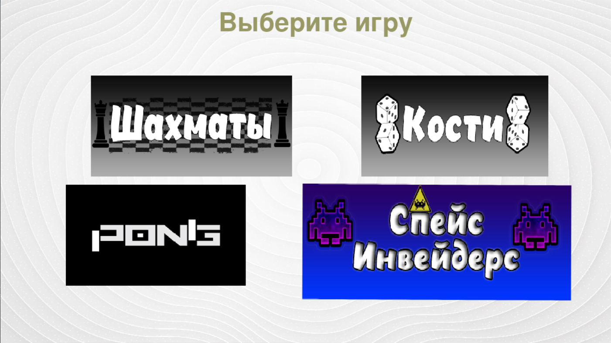
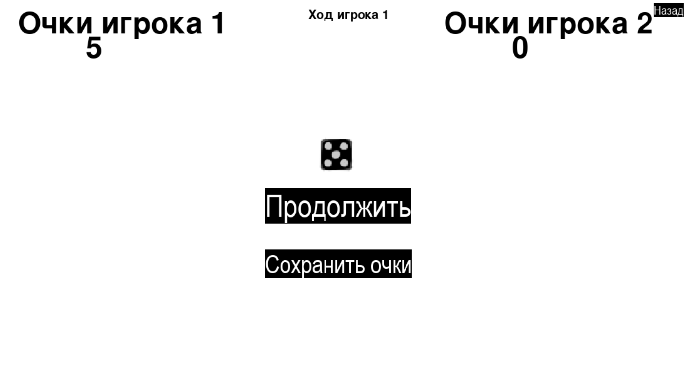
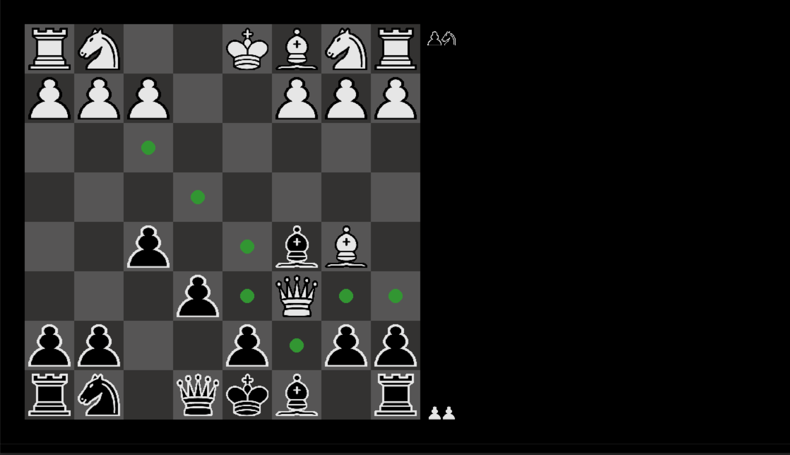
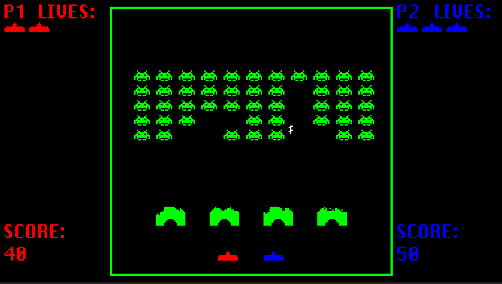
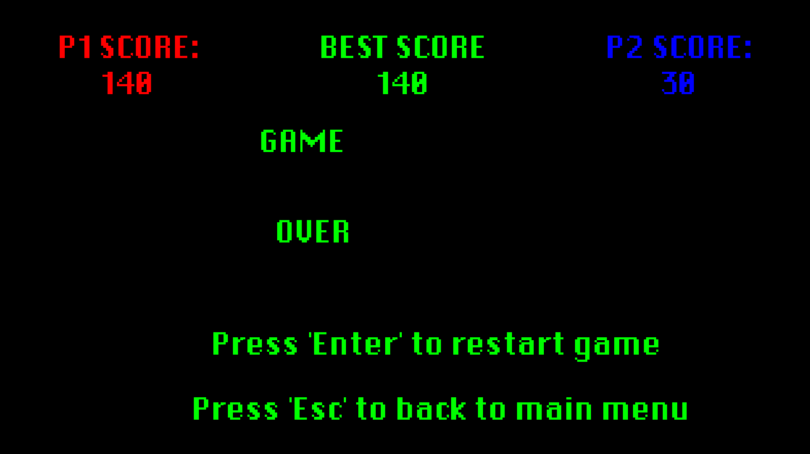

# Pygame Minigames
**[Русский](#russian-version) | [English](#english-version)**

## Russian version
Сборник мини-игр на Pygame с использованием SQLite для хранения очков.

### Игры
- **Dice**: Игра в кости для двух игроков с анимацией кубика.
- **Pong**: Классический теннис для двух игроков.
- **Space Invaders**: Клон игры с уровнями, щитами и лидербордом.
- **Chess (WIP)**: Шахматы для двух игроков (прототип, не реализована логика шахов)

### Установка
1. Склонируйте репозиторий:
   ```
   git clone https://github.com/FedotovSvyatoslav/Pygame_minigames
   ```
   
2. Установите зависимости:
   ``` 
   pip install -r requirements.txt 
   ```

3. Запустите 
   ```
   python src/main.py
   ```
   
### Управление
- **Dice**: Нажмите «Играть», чтобы бросить кость, «Продолжить» или «Сохранить», чтобы продолжить.
- **Pong**: Игрок 1 (W/S), Игрок 2 (Up/Down).
- **Space Invaders**: Игрок 1 (A/D - перемещение, W - выстрел), Игрок 2 (Влево/Вправо - перемещение, Вверх - выстрел).
- **Chess**: Мышь для выбора и перемещения фигур (WIP).

### Особенности
- Модульная структура с разделением логики.
- Использование SQLite для сохранения лучшего счета (Space Invaders).
- Интерактивное меню с иконками.


### Структура проекта
* src/data/: Файлы с изображениями, аудио и шрифтами
* src/games/: Модули с логикой каждой из игр
* src/sql_scripts/: SQL-скрипты для работы с SQLite базой данных

### Скриншоты






### Участники
* [Сагимбаев Тимур](https://github.com/Timdevcc) — Разработал главный экран и второе меню (с выбором игр), выделил и описал классы в модуле `utils`. Разработал игры **Dice** и **Pong**
* [Федотов Святослав](https://github.com/FedotovSvyatoslav) — Выделил константы в модуль `config`, описал функции загрузки файлов ресурсов в `utils`. Разработал игры **Chess** (WIP) и **Space Invaders**. Провёл рефакторинг всего репозитория, составил нынешнюю структуру проекта


---


## English Version

A collection of mini-games in Pygame using SQLite to store scores.

### Games
- **Dice**: A two-player dice game with dice animation.
- **Pong**: Classic tennis game for two players.
- **Space Invaders**: A clone game with levels, shields and leaderboard.
- **Chess (WIP)**: Chess for two players (prototype, lacks checkmate logic).

### Installation
1. Clone the repository:
   ```
   git clone https://github.com/FedotovSvyatoslav/Pygame_minigames
   ```
   
2. Install dependencies:
   ``` 
   pip install -r requirements.txt 
   ```

3. Run 
   ```
   python src/main.py
   ```

### Controls
- **Dice**: Click "Play" to roll, "Continue" or "Save" to proceed.
- **Pong**: Player 1 (W/S), Player 2 (Up/Down).
- **Space Invaders**: Player 1 (A/D to move, W to shoot), Player 2 (Left/Right to move, Up to shoot).
- **Chess**: Mouse to select and move pieces (WIP).

### Features
- Modular structure with separation of logic.
- Use of SQLite to save the best score (Space Invaders).
- Interactive menu with icons.


### Project structure
* src/data/: Files with images, audio and fonts
* src/games/: Modules with logic of each game
* src/sql_scripts/: SQL scripts for working with SQLite database

### Screenshots


### Contributors
- [Timur Sagimbaev](https://github.com/Timdevcc) — Developed the main screen, second menu (game selection), defined classes in `utils`. Created **Dice** and **Pong**.
- [Svyatoslav Fedotov](https://github.com/FedotovSvyatoslav) — Extracted constants to `config`, implemented resource loading in `utils`. Created **Chess** (WIP) and **Space Invaders**. Refactored the repository and defined the current structure.